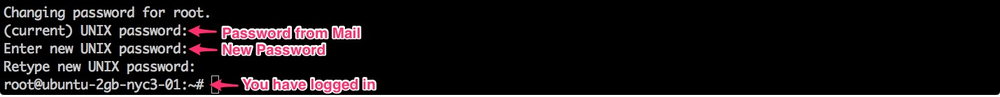

# How to set-up Codespaces on DigitalOcean

This tutorial is about running Codespaces on DigitalOcean.

## Account Sign Up

* First step is to create an account on DigitalOcean.
Sign up using the following [**Link**](https://cloud.digitalocean.com/registrations/new).

* After signing up, you will be receiving a mail with an activation link.

* Check your inbox and click on the activation link.

## Use Promo Code

* **School of Devops** and DigitalOcean provides you with a promo code with which you will be able to run a machine with a 2GB of memory, is more than enough to run our DevOps IDE **Codespaces**.

* After activating your account, Fill up your *Credit/Debit Card* details to start.

* Then click on *Have a Promo Code?*

* Its time to apply our Promo code. Copy the following code and click on *Apply Code*

    **SCHOOLOFDEVOPS-11bc7f15**

* If you have followed all the steps correctly, you will be presented with the following page.

* Make the following selections, without any changes.

## User-Data

* This step may seem tricky. So pay close attention. You have to select the correct **User-Data** for the tool you are going to learn.

* In this tutorial, We will be using User-Data for **Docker**.

* User-Data for other tools is available in **User-Data** directory of this repository.

* Finally click on *Create*

* Now your Droplet will be created and ready to be used.

## Codespaces IDE

* The **User-Data** script will take **5 - 7 mins**
to install and bring up Codespaces IDE.

* Visit your machines IP on **Port 8000** to see Codespaces IDE in action.

* At the first time, You will be asked to enter your e-mail.

* After clicking on **Enter**, you will be able to use *Codespaces*.

## SSH to the Droplet (Optional)

* The credentials for your Droplet will be mailed to you.

* Check your inbox and find these credentials.

* SSH to the Droplet using the credentials sent to you.

* After logging in, you will be asked to reset the password.

* Choose and your password and reset your default one.

